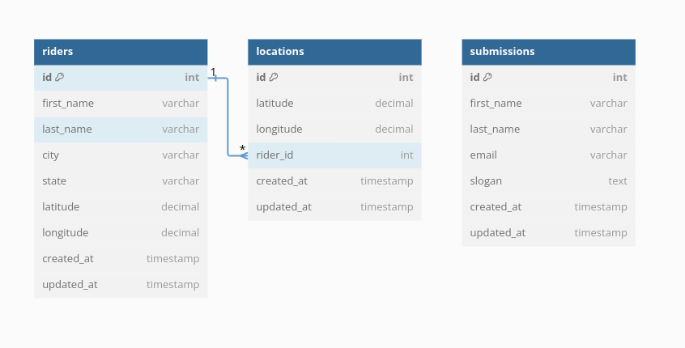
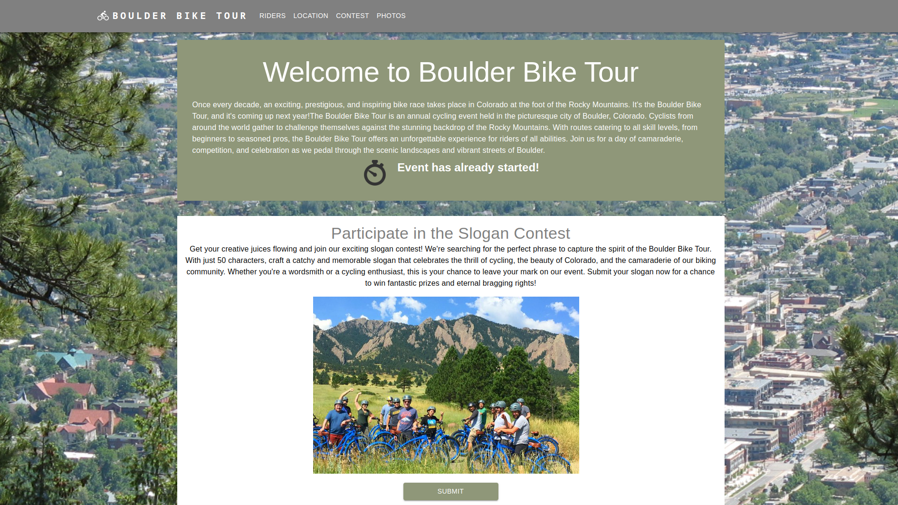
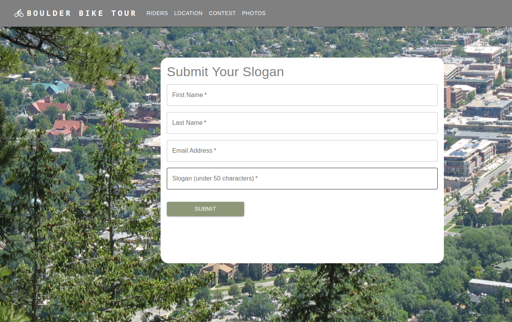
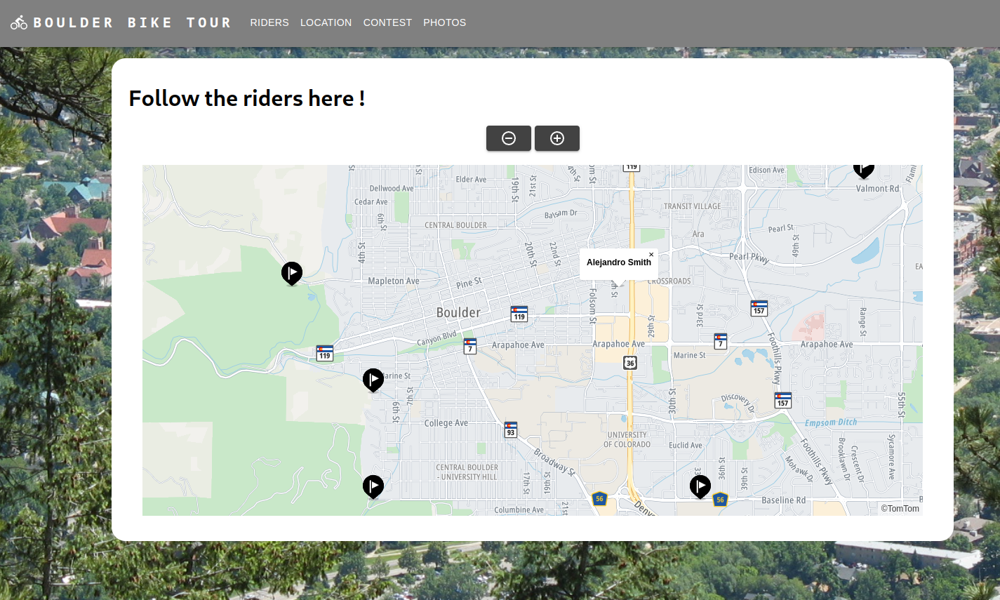

# Boulder Bike Project

## Overview

This project is for the Boulder Bike Tour application, developed as part of the Ruby on Rails project for Openclassrooms. The application allows users to track bike riders' locations in real-time during the Boulder Bike Tour event.

## Built With

- Ruby v2.7.2
- Ruby on Rails v6.1.0
- PostgreSQL
- React v17.0.2
- TomTom Maps API
- MUI (formerly Material-UI) for UI components

## Getting Started

To get a local copy up and running, follow these simple steps:

### Initial Setup

1. Clone this repository with `git clone (https://github.com/MagaliFabre/Boulder_bike.git)` using your terminal or command line.
2. Change to the project directory by entering `cd boulder_bike` in the terminal.
3. Navigate to the `boulder_bike` directory for the Rails backend, and follow the setup instructions in the `README.md` file.
4. Navigate to the `bouldereact` directory for the React frontend, and follow the setup instructions in the `README.md` file.

## Features

- Real-time tracking of bike riders' locations using TomTom Maps API.
- Zoom in/out functionality to adjust map view.
- Display of rider information (first name, last name) on map markers.
- Easy navigation controls to browse through different map views.
- Responsive design for seamless user experience across devices.

## Usage

1. Start the Rails server by running `rails server` in the `boulder_bike` directory.
2. Start the React development server by running `npm start` in the `bouldereact` directory.
3. Open `http://localhost:3001/` in your browser to view the Boulder Bike Tour application.

## Db schema

## Home page

## Submission form 

## TomTom Map

## Authors

- Magali Fabre

## Acknowledgments

- TomTom Maps API
- [MUI (formerly Material-UI)](https://mui.com/)

## License

This project is licensed under the [MIT License](LICENSE).
